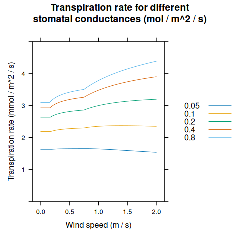
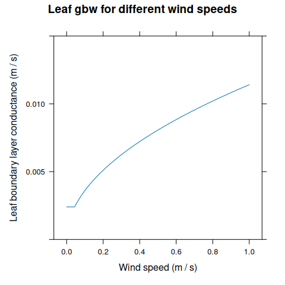

# Energy Balance, Transpiration, and Leaf Temperature

## 1 Canopy Energy Balance

Energy balance is discussed in many sources, such as Thornley and
Johnson ([1990](#ref-thornley_plant_1990)) and Campbell and Norman
([1998](#ref-campbell_introduction_1998)), the two main references for
BioCro models. Here we begin with a general discussion, mostly using the
notation from Chapter 14 of Thornley and Johnson
([1990](#ref-thornley_plant_1990)), but also borrowing a bit from
Chapters 12 and 14 of Campbell and Norman
([1998](#ref-campbell_introduction_1998)).

First, the total light energy (shortwave and longwave) absorbed by the
canopy (\\J_a\\) is all dissipated or stored by the following processes:

- Long-wave energy loss to the environment

- Convective heat transfer between the canopy and the air

- Evaporation of water from the interior surfaces of the leaves

- Conductive heat transfer between the canopy and the ground

- Canopy metabolism

- Heat storage by the canopy

Mathematically, we can express this idea as

\\\begin{equation} J_a - R_L - H - \lambda E - G - M = q, \tag{1.1}
\end{equation}\\

where \\R_L\\ is the rate of long-wave energy loss, \\H\\ is the rate of
conductive heat transfer, \\\lambda\\ is the latent heat of vaporization
of water, \\E\\ is the transpiration rate, \\G\\ is the rate of heat
loss to the ground, \\M\\ is the rate of energy used by canopy
metabolism, and \\q\\ is the rate of heat storage by the canopy. Most of
the quantities above are energy flux densities with typical units of J
m\\^{-2}\\ s\\^{-1}\\. The only exception is \\\lambda\\, which
typically has units of J kg\\^{-1}\\. Equation [(1.1)](#eq:EB1) is a
crop-specific version of the more general principle of [conservation of
energy](https://en.wikipedia.org/wiki/Conservation_of_energy), and it
already begins to highlight the connection between energy and
transpiration.

The term “energy balance” is synonymous with “steady-state energy flow.”
Thus, energy balance calculations are always made under the assumption
that \\q = 0\\. Another simplification is that the metabolic processes
of photosynthesis and respiration only dissipate a small fraction of the
incident energy, and can thus be ignored. Finally, we can combine
\\J_a\\, \\R_L\\, and \\G\\ into a single term (\\\phi_N\\):

\\\begin{equation} \phi_N = J_a - R_L - G. \tag{1.2} \end{equation}\\

With these changes, [(1.1)](#eq:EB1) becomes

\\\begin{equation} \phi_N - H - \lambda E = 0. \tag{1.3}
\end{equation}\\

In other words, \\\phi_N\\ is the net energy available to the crop for
driving transpiration and sensible heat loss.

The terms \\H\\ and \\E\\ are related to the conductance of heat and
water vapor from the canopy to the ambient environment. In fact, they
can be both be expressed using one-dimensional diffusion equations:

\\\begin{equation} H = \rho c_p \left( T_l - T_a \right) g_H \tag{1.4}
\end{equation}\\

and

\\\begin{equation} E = \left(\rho\_{vl} - \rho\_{va} \right) g_W,
\tag{1.5} \end{equation}\\

where \\\rho\\ is the density of dry air (kg m\\^{-3}\\), \\c_p\\ is the
specific heat capacity of dry air (J kg\\^{-1}\\ K\\^{-1}\\), \\T_a\\
and \\T_l\\ are the temperatures of the ambient air and the leaves in
canopy, respectively (K), \\\rho\_{va}\\ and \\\rho\_{vl}\\ are the
water vapor densities in the ambient air and within the leaves,
respectively (kg water m\\^{-3}\\), and \\g_H\\ and \\g_W\\ are the
conductances to heat and water vapor (m s\\^{-1}\\). Note that
temperatures are expressed in K here to ensure that the product \\\rho
c_p T\\ is an energy density with units J m\\^{-3}\\ (even though the
temperature difference \\T_l - T_a\\ is numerically identical whether K
or \\^{\deg}\\C are used for the temperatures). Thus, both Equation
[(1.4)](#eq:H) and [(1.5)](#eq:E) express a flux density as the product
of a conductance and a density gradient.

For a healthy leaf with sufficient access to water, in an environment
with reasonably low vapor pressure deficit, the air in its intercellular
spaces is close to full saturation ([Wong et al.
2022](#ref-wong_humidity_2022)). Thus, here we will make a simplifying
assumption that \\\rho\_{vl} = \rho\_{sat}(T_l)\\, where
\\\rho\_{sat}(T_l)\\ is the saturation water vapor density at the leaf
temperature. With this assumption, Equation [(1.5)](#eq:E) can be
expressed as

\\\begin{equation} E = \left\[ \rho\_{sat}(T_l) - \rho\_{va} \right\]
g_W. \tag{1.6} \end{equation}\\

Combining Equations [(1.3)](#eq:EB2), [(1.4)](#eq:H), and
[(1.6)](#eq:E2), we can now express the energy balance requirement as

\\\begin{equation} \phi_N - \rho c_p \left( T_l - T_a \right) g_H -
\lambda \left\[ \rho\_{sat}(T_l) - \rho\_{va} \right\] g_W = 0.
\tag{1.7} \end{equation}\\

This is a powerful equation because all of its terms either (i) can be
taken as constant for a given set of environmental conditions or (ii)
have a known dependence on the leaf temperature. Because of this, we can
consider Equation [(1.7)](#eq:EB3) as a way to calculate the temperature
of leaves in the canopy. Once \\T_l\\ is known, Equation [(1.6)](#eq:E2)
can be used to calculate the transpiration rate \\E\\. Often this is the
main goal of an energy balance calculation, since the transpiration rate
determines crop water use.

However, Equation [(1.7)](#eq:EB3) cannot be solved analytically as it
is written. One main option is to solve it using a numerical approach,
while another is to approximate some of its terms in a way that enables
an analytical expression for \\T_l\\ and \\E\\. The following sections
will discuss different approaches to this problem with varying levels of
complexity.

## 2 A Penman-Monteith Equation

Here we continue following Chapter 12 of Thornley and Johnson
([1990](#ref-thornley_plant_1990)), which derives analytical expressions
for \\T_l\\ and \\E\\ based on energy balance (Equation
[(1.7)](#eq:EB3)). In this approach, we make a few more assumptions:

- We treat the diffusion path for water vapor as consisting of two
  sequential components: (i) diffusion from the intercellular spaces
  across the stomata to the leaf surfaces (with conductance \\g_c\\)
  and (ii) diffusion from the leaf surfaces across the boundary layer to
  the bulk atmosphere (with conductance \\g_a\\).

- We assume that the flows of water vapor and heat across the boundary
  layer are driven by the same mechanical processes.

- We assume that \\\phi_N\\, \\g_a\\, and \\g_c\\ do not depend on
  \\T_l\\.

- We assume that the temperature difference between the ambient air and
  the leaves in the canopy (\\\Delta T = T_l - T_a\\) is small.

When \\\Delta T\\ is small, it is possible to linearize the equation for
saturation water vapor density \\\rho\_{sat}(T)\\. This is an approach
first taken by Penman. To do this, we first express \\\rho\_{sat}(T_l)\\
as a [Taylor series](https://en.wikipedia.org/wiki/Taylor_series)
centered on \\T_a\\:

\\\begin{equation} \rho\_{sat}(T_l) = \rho\_{sat}(T_a) + \frac{d
\rho\_{sat}}{d T} \bigg\rvert\_{T_a} \cdot \Delta T + \frac{1}{2!} \cdot
\frac{d^2 \rho\_{sat}}{d T^2} \bigg\rvert\_{T_a} \cdot \left( \Delta T
\right)^2 + ... \end{equation}\\

If \\\Delta T\\ is small, then \\(\Delta T)^2\\ is even smaller, and we
can consider it and any higher-order terms to be negligable. In this
case, we can keep just the first two terms of the Taylor series:

\\\begin{equation} \rho\_{sat}(T_l) \approx \rho\_{sat}(T_a) + s \Delta
T \tag{2.1}, \end{equation}\\

where \\s = \frac{d \rho\_{sat}}{d T} \bigg\rvert\_{T_a}\\ is the slope
of \\\rho\_{sat}(T)\\ at \\T = T_a\\. With this simplification, Equation
[(1.6)](#eq:E2) becomes

\\\begin{equation} E = \left\[ \rho\_{sat}(T_a) + s \left( \Delta T
\right) - \rho\_{va} \right\] g_W = \left( \Delta \rho\_{va} + s \Delta
T \right) g_W \tag{2.2} \end{equation}\\

where \\\Delta \rho\_{va} = \rho\_{sat}(T_a) - \rho\_{va}\\ is the vapor
density deficit of the ambient air.

Because the stomata and boundary layer are in series, the total
conductance to water vapor (\\g_W\\) is related to \\g_a\\ and \\g_c\\
according to

\\\begin{equation} \frac{1}{g_W} = \frac{1}{g_a} + \frac{1}{g_c},
\tag{2.3} \end{equation}\\

Additionally, because the same mechanisms of conduction and convection
drive the flow of both water vapor and heat in the boundary layer, these
conductances are identical:

\\\begin{equation} g_H = g_a. \tag{2.4} \end{equation}\\

Combining Equations [(1.7)](#eq:EB3), [(2.1)](#eq:linearRho),
[(2.3)](#eq:gW), and [(2.4)](#eq:gH), we can arrive at an expression of
conservation of energy for a crop canopy where only water vapor
conductances are used:

\\\begin{equation} \phi_N - \rho c_p \Delta T g_a - \frac{\lambda \left(
\Delta \rho\_{va} + s \Delta T \right)}{1 / g_a + 1 / g_c} = 0.
\tag{2.5} \end{equation}\\

These may not look simple. Nevertheless, with some algebra, Equation
[(2.5)](#eq:EB4) can be solved for the temperature difference \\\Delta
T\\:

\\\begin{equation} \Delta T = \frac{\phi_N \left( 1 / g_a + 1 / g_c
\right) - \lambda \Delta \rho\_{va}}{\lambda \left\[ s + \gamma \left(
1 + g_a / g_c \right) \right\]} \tag{2.6} \end{equation}\\

where \\\gamma = \frac{\rho c_p}{\lambda}\\ is the “psychrometric
parameter.” This is Equation 14.11e in Thornley and Johnson
([1990](#ref-thornley_plant_1990)). Note that by assumption, everything
on the right-hand side is independent of the leaf temperature. Values of
\\s\\, \\\rho\\, \\c_p\\, etc can be found in reference tables, so if
values of \\\phi_N\\, \\g_a\\, etc, are known or can be estimated, then
Equation [(2.6)](#eq:DT1) can be used to calculate \\\Delta T\\ (and
hence \\T_l\\). It can also be plugged in to Equation [(2.2)](#eq:E3) to
calculate the canopy transpiration rate \\E\\:

\\\begin{equation} E = \frac{s \phi_N + \lambda \gamma g_a \Delta
\rho\_{va}}{\lambda \left\[ s + \gamma \left(1 + g_a / g_c \right)
\right\]}, \tag{2.7} \end{equation}\\

This is Equation 14.4k from Thornley and Johnson
([1990](#ref-thornley_plant_1990)), where it is described as “the
Penman-Monteith equation.” However, just one page later, Thornley and
Johnson ([1990](#ref-thornley_plant_1990)) gives an alternate version
(Equation 14.5d). As it turns out, there are many different equations
referred to as “the Penman-Monteith equation” throughout textbooks and
the plant physiology literature. Thus, we prefer to call it “a
Penman-Monteith equation” to indicate it is just one example from a
group of potential Penman-Monteith equations. In the next section, we
will discuss another version.

## 3 Another Penman-Monteith Equation

The assumptions given at the start of the [previous
section](#pmthornley) are not the only way to build analytical
expressions for \\\Delta T\\ and \\E\\ from Equation [(1.7)](#eq:EB3).
In fact, a different approach can be found in Chapter 14 of Campbell and
Norman ([1998](#ref-campbell_introduction_1998)). Here we make some
alternate assumptions:

- We assume that \\J_a\\ and \\G\\ do not depend on leaf temperature,
  but we use the [Stefan-Boltzmann
  law](https://en.wikipedia.org/wiki/Stefan%E2%80%93Boltzmann_law) to
  calculate \\R_L\\ from \\T_l\\.

- We assume that \\g_H\\ and \\g_W\\ do not depend on leaf temperature.

- We assume that the temperature difference between the ambient air and
  the leaves in the canopy (\\\Delta T = T_l - T_a\\) is small.

Applying the Stefan-Boltzmann law, we now have an expression for
\\R_L\\:

\\\begin{equation} R_L = \epsilon_s \sigma T_l^4, \end{equation}\\

where \\\epsilon_s\\ is the canopy surface emissivity and \\\sigma\\ is
the Stefan-Boltzmann constant.

Because \\\Delta T\\ is small, we can linearize the saturation water
vapor density as before (Equation [(2.1)](#eq:linearRho)). We can also
linearize \\R_L\\ by noting that

\\\begin{equation} T_L^4 = (T_a + \Delta T)^4 = T_a^4 + 4 T_a^3 \Delta
T + 6 T_a^2 (\Delta T)^2 + 4 T_a (\Delta T)^3 + (\Delta T)^4.
\end{equation}\\

We can again neglect terms with \\\Delta T^2\\ or higher powers,
yielding

\\\begin{equation} R_L \approx \epsilon_s \sigma \left( T_a^4 + 4 T_a^3
\Delta T \right) = \epsilon_s \sigma T_a^4 - \rho c_p \Delta T g_r,
\tag{3.1} \end{equation}\\

where \\g_r = 4 \epsilon_s \sigma T_a^3 / ( \rho c_p)\\ is a “radiative
conductance” with units m s\\^{-1}\\. Substituing this linearization
into Equation [(1.2)](#eq:phiN) yields

\\\begin{equation} \phi_N = J_a - \epsilon_s \sigma T_a^4 - \rho c_p
\Delta T g_r - G, \tag{3.2} \end{equation}\\

Combining Equations [(1.7)](#eq:EB3), [(2.1)](#eq:linearRho), and
[(3.2)](#eq:newphilinear), we have yet another a new version of the
canopy energy balance equation:

\\\begin{equation} J_a - \epsilon_s \sigma T_a^4 - \rho c_p \Delta T
g_r - G - \rho c_p \Delta T g_H - \lambda \left( \Delta \rho\_{va} + s
\Delta T \right) g_W = 0. \end{equation}\\

This can also be written as

\\\begin{equation} J_a - \epsilon_s \sigma T_a^4 - G - \rho c_p g\_{Hr}
\Delta T - \lambda \left( \Delta \rho\_{va} + s \Delta T \right) g_W =
0, \tag{3.3} \end{equation}\\

where \\g\_{Hr} = g_r + g_H\\ is a combined conductance for radiation
and heat. This expression of energy balance can now be solved for
\\\Delta T\\ to produce an equation analgous to Equation
[(2.6)](#eq:DT1):

\\\begin{equation} \Delta T = \frac{\left( J_a - \epsilon_s \sigma
T_a^4 - G \right) / g_W - \lambda \Delta \rho\_{va}}{\lambda \left\[ s +
\gamma (g\_{Hr} / g_W) \right\]}. \tag{3.4} \end{equation}\\

Equation [(3.4)](#eq:DT2) can be substituted into Equation
[(2.2)](#eq:E3) to calculate the canopy transpiration rate \\E\\:

\\\begin{equation} E = \frac{s \left( J_a - \epsilon_s \sigma T_a^4 - G
\right) + \lambda \gamma g\_{Hr} \Delta \rho\_{va}}{\lambda \left\[ s +
\gamma (g\_{Hr} / g_W) \right\]}. \tag{3.5} \end{equation}\\

This equation is analagous to, but different from, Equation
[(2.7)](#eq:PM1). Disregarding differences in notation, it is also
identical to Equation 14.12 from Campbell and Norman
([1998](#ref-campbell_introduction_1998)), where it is described as
follows:

> This is the well known and widely used Penman-Monteith equation for
> estimating evapotranspiration from plant communities.

Yet, it is substantially different from the Penman-Monteith equation
given in Thornley and Johnson ([1990](#ref-thornley_plant_1990)) due to
the different assumptions and linearizations made while deriving it.

## 4 The Penman-Monteith Approach

Sections [2](#pmthornley) and [3](#pmcampbell) illustrate two possible
ways to make approximations that enable Equations [(1.7)](#eq:EB3) and
[(1.6)](#eq:E2) to be solved for \\T_l\\ and \\E\\. However, there are
many possible choices that could, in principle, each lead to slightly
different versions of the equations:

- Energy balance can be considered at the canopy or leaf scale.

- Water vapor concentrations can be expressed as vapor densities,
  partial pressures, or mole fractions.

- \\R_L\\ can be linearized or considered as a
  leaf-temperature-independent component of \\\phi_N\\.

- The diffusion path for water vapor can be separated into distinct
  sequential steps or treated as a single process.

This list is not necessarily exhaustive, but serves to illustrate the
idea that there is not one single Penman-Monteith equation. However,
each potential version of the equation includes a linearization of
\\p\_{sat}(T_l)\\ and possibly \\R_L(T_l)\\, approximating each of these
as a linear function of \\\Delta T\\. This linearization is what enables
the energy balance equation to be solved for \\T_l\\. Thus, this
“Penman-Monteith approach” is common to all of these equations even when
there are differences between the equations themselves.

## 5 Energy Balance in BioCro

In Sections [1](#generalEB), [2](#pmthornley), and [3](#pmcampbell), the
canopy transpiration rate \\E\\ depends on canopy-level conductances:
\\g_H\\, \\g_W\\, \\g_a\\, \\g_c\\, and \\g_r\\. In practice, these
conductances are difficult to estimate *a priori* because they depend on
gradients of wind speed, light intensity, and other factors within a
plant canopy. In BioCro, we take an alternate approach where
transpiration rates are estimated at the leaf level and then scaled up
to the canopy level. This enables us to use models for leaf-level
conductance (such as the Ball-Berry model for stomatal conductance) and
also to account for variations in key inputs like \\J_a\\ throughout the
canopy. In this framework, the total canopy transpiration rate is given
by

\\\begin{equation} E\_{canopy} = \int\_{\ell = 0}^{L} \left(
E\_{leaf}^{sunlit}(\ell) \cdot f\_{sunlit}(\ell) +
E\_{leaf}^{shaded}(\ell) \cdot f\_{shaded}(\ell) \right) d \ell,
\tag{5.1} \end{equation}\\

where \\E\_{leaf}^{sunlit}(\ell)\\ and \\E\_{leaf}^{shaded}(\ell)\\ are
the leaf-level transpiration rates per leaf area for sunlit and shaded
leaves at cumulative leaf area index (cLAI) \\\ell\\,
\\f\_{sunlit}(\ell)\\ and \\f\_{shaded}(\ell)\\ are the fractions of
sunlit and shaded leaf area at \\\ell\\, and \\L\\ is the total canopy
leaf area index (LAI).

The equations derived above using the Penman-Monteith approach assume
that \\g_W\\ is independent of both leaf temperature and incident light
intensity. Realistically, this assumption is likely to be violated
because stomatal conductance changes dynamically with photosynthesis,
which in turn changes dynamically with leaf temperature and incident
light intensity. There is also a buoyancy component to boundary layer
conductance that depends on leaf temperature. The equations used to
calculate these conductances are complex and not readily amenable to the
types of linearizations employed in the Penman-Monteith approach. So, in
BioCro, we take a hybrid approach to energy balance where \\T_l\\ is
varied iteratively to simultaneously determine \\g_W\\, \\T_l\\, and
\\E\\ using Equation [(2.6)](#eq:DT1). See the `leaf_energy_balance()`
function in BioCro’s `C++` code for more details.

Because \\E\_{leaf}\\ is calculated numerically in BioCro, it is not
possible to obtain an analytical expression for \\E\_{canopy}\\ using
Equation [(5.1)](#eq:ECanopyInt). Instead, the integral is approximated
using a [Riemann sum](https://en.wikipedia.org/wiki/Riemann_sum):

\\\begin{equation} E\_{canopy} = \sum\_{i = 0}^{N-1} \left(
E\_{leaf}^{sunlit}(\ell_i) \cdot f\_{sunlit}(\ell_i) +
E\_{leaf}^{shaded}(\ell_i) \cdot f\_{shaded}(\ell_i) \right) \cdot
\frac{L}{N}. \tag{5.2} \end{equation}\\

Here the cLAI interval \\(0, L)\\ has been divided into \\N\\
sub-intervals of equal width (\\L / N\\) and \\\ell_i = (i + 0.5) \cdot
L / N\\ is the midpoint of the \\i^{th}\\ sub-interval.

Values of \\T_l\\ and \\E\\ calculated from energy balance are sensitive
to the conductances across the stomata and boundary layer. Yet, the
boundary layer conductance in particular is difficult to estimate
because it depends on details such as wind speed, leaf shape, and other
factors that change dynamically in realistic conditions and cannot be
easily quantified. In BioCro, we consider the flow of water vapor from
the leaf’s intercellular spaces to the bulk air in the atmosphere to
consist of three sequential steps as the gas crosses the stomata, the
leaf boundary layer, and finally the canopy boundary layer. The latter
two conductances combine to form the overall boundary layer conductance:

\\\begin{equation} \frac{1}{g_b} = \frac{1}{g\_{b,leaf}} +
\frac{1}{g\_{b,canopy}}, \end{equation}\\

where \\g\_{b,leaf}\\ and \\g\_{g,canopy}\\ are the conductances across
the leaf and canopy boundary layers.

\\g\_{b,leaf}\\ is calculated using a model described in Campbell and
Norman ([1998](#ref-campbell_introduction_1998)). It treats the leaves
in the canopy as individual flat objects in a moving air stream, and
considers free and forced convection, where free convection is driven by
wind and forced convection is driven by temperature gradients. In
BioCro, wind speed within the canopy is modeled as an exponential decay
with the cumulative leaf area index, and this depth-dependent wind speed
is used to calculate \\g\_{b,leaf}\\. Because of this, \\g\_{b,leaf}\\
changes throughout the canopy and is slightly different for sunlit and
shaded leaves.

On the other hand, \\g\_{b,canopy}\\ is calculated using a model
described in Thornley and Johnson ([1990](#ref-thornley_plant_1990)). It
treats the canopy as an infinitely wide rough surface covering the
ground, and only considers turbulent flow, so \\g\_{b,canopy}\\
primarily depends on the wind speed measured above the canopy. The model
equations predict \\g\_{b,canopy} = 0\\ when wind speed is zero. In
reality, temperature-driven convection would occur at low wind speeds,
setting a lower limit for \\g\_{b,canopy}\\ as in the model for
\\g\_{b,leaf}\\. To account for this in a simple way, a minimum value of
\\g\_{b,canopy}\\ is enforced in BioCro. The minimum conductance is a
parameter that can be varied by the user. \\g\_{b,canopy}\\ is the same
for sunlit and shaded leaves at all depths within the canopy.

### 5.1 BioCro Examples

``` r
library(BioCro)
library(lattice)
```

BioCro’s leaf-level energy balance model:

``` r
transpiration_res <- module_response_curve(
    'BioCro:leaf_evapotranspiration',
    list(
        absorbed_shortwave = 250,
        atmospheric_pressure = 101325,
        temp = 25,
        canopy_height = 1,
        leafwidth = 0.1,
        min_gbw_canopy = 0.005,
        rh = 0.6,
        wind_speed_height = 10
    ),
    expand.grid(
        windspeed = seq(0, 2, by = 0.005),
        Gs = c(0.05, 0.1, 0.2, 0.4, 0.8)
    )
)

xyplot(
    TransR ~ windspeed,
    group = Gs,
    data = transpiration_res,
    type = 'l',
    auto = TRUE,
    xlab = 'Wind speed (m / s)',
    ylab = 'Transpiration rate (mmol / m^2 / s)',
    ylim = c(0, 5),
    main = 'Transpiration rate for different\nstomatal conductances (mol / m^2 / s)'
)
```



``` r

xyplot(
    leaf_temperature ~ windspeed,
    group = Gs,
    data = transpiration_res,
    type = 'l',
    auto = TRUE,
    xlab = 'Wind speed (m / s)',
    ylab = 'Leaf temperature (degrees C)',
    ylim = c(25, 50),
    main = 'Leaf temperature for different\nstomatal conductances (mol / m^2 / s)'
)
```


BioCro’s model for canopy boundary layer conductance:

``` r
canopy_gbw_res <- module_response_curve(
    'BioCro:canopy_gbw_thornley',
    list(
        min_gbw_canopy = 0,
        windspeed_height = 10
    ),
    expand.grid(
        windspeed = seq(0, 2, by = 0.025),
        canopy_height = seq(0.5, 2, by = 0.5)
    )
)

xyplot(
    gbw_canopy ~ windspeed,
    group = canopy_height,
    data = canopy_gbw_res,
    type = 'l',
    auto = TRUE,
    xlab = 'Wind speed (m / s)',
    ylab = 'Canopy boundary layer conductance (m / s)',
    ylim = c(0, 0.02),
    main = 'Canopy gbw for different canopy heights'
)
```


BioCro’s model for leaf boundary layer conductance:

``` r
leaf_gbw_res <- module_response_curve(
    'BioCro:leaf_gbw_campbell',
    list(
        air_pressure = 101325,
        leaf_temperature = 26,
        leafwidth = 0.1,
        temp = 25

    ),
    expand.grid(
        windspeed = seq(0, 1, by = 0.005)
    )
)

xyplot(
    gbw_leaf ~ windspeed,
    data = leaf_gbw_res,
    type = 'l',
    auto = TRUE,
    xlab = 'Wind speed (m / s)',
    ylab = 'Leaf boundary layer conductance (m / s)',
    ylim = c(0, 0.015),
    main = 'Leaf gbw for different wind speeds'
)
```



## References

Campbell, Gaylon S., and John Norman. 1998. *An Introduction to
Environmental Biophysics*. 2nd ed. New York: Springer-Verlag.
<https://www.springer.com/gp/book/9780387949376>.

Thornley, John H. M., and I. R. Johnson. 1990. *Plant and Crop
Modelling: A Mathematical Approach to Plant and Crop Physiology*.

Wong, Suan Chin, Martin J. Canny, Meisha Holloway-Phillips, Hilary
Stuart-Williams, Lucas A. Cernusak, Diego A. Márquez, and Graham D.
Farquhar. 2022. “Humidity Gradients in the Air Spaces of Leaves.”
*Nature Plants* 8 (8): 971–78.
<https://doi.org/10.1038/s41477-022-01202-1>.
