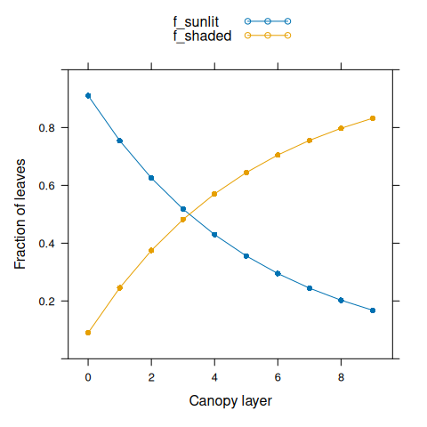
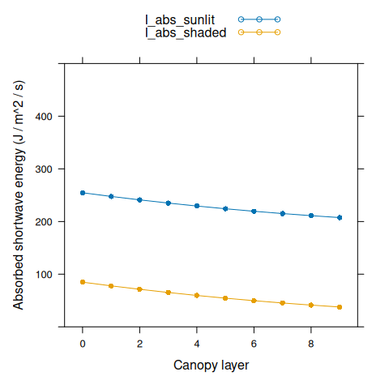

# Canopy Photosynthesis Models

## 1 A General Canopy Photosynthesis Model

At the leaf level, the net CO\\\_2\\ assimilation rate per unit leaf
area (\\A\_{n,leaf}\\) depends on the incident photosynthetically active
photon flux density (PPFD; \\Q\_{in}\\), the absorbed shortwave energy
(\\I\_{abs}\\), the ambient CO\\\_2\\ concentration outside the boundary
layer (\\C_a\\), the air temperature (\\T_a\\), the relative humidity
(\\h_a\\), and several other environmental factors. Mathematically, we
can express this by writing \\A_n\\ as a function of these variables:
\\A\_{n,leaf} = A\_{n,leaf}(Q\_{in}, I\_{abs}, C_a, T_a, h_a)\\. The
exact equation used to calculate \\A\_{n,leaf}\\ will generally depend
on individual choices for modelling photosynthetic biochemistry,
stomatal response, and energy balance. For simplicity, we do not attempt
to reproduce them here.

Each of these environmental variables may change throughout a crop
canopy. A common way to treat this is to express each of them as a
function of the cumulative leaf area index (cLAI; \\\ell\\). At the top
of the canopy, \\\ell = 0\\, and it increases to \\\ell = L\\ at the
bottom of the canopy, where \\L\\ is the whole-canopy leaf area index
(LAI). LAI itself is defined as the one-sided leaf area per unit ground
area. It can be loosely interpreted as the number of leaf layers
covering the ground. cLAI can then be interpreted as the LAI of leaves
above a certain point in the canopy.

For a wide area of a crop that has achieved canopy closure, lateral
position within the field is not expected to influence environmental
conditions, leaving depth within the canopy as the main variable.
Cumulative LAI is a way to express depth within the canopy using leaf
area, since the amount of leaf area above a particular point is more
important for determining \\Q\_{in}\\ (and the other variables) than the
physical distance below the canopy top.

With this in mind, we can write \\A\_{n,leaf} =
A\_{n,leaf}(Q\_{in}(\ell), I\_{abs}(\ell), C_a(\ell), T_a(\ell),
h_a(\ell))\\. This notation is a bit unweildy, and it can be made more
compact by writing \\A\_{n,leaf} = A\_{n,leaf}(\ell)\\. In this form, it
is implied that each of the inputs to the photosynthesis model used to
calculate \\A\_{n,leaf}\\ change with \\\ell\\. This notation is
convenient because it allows us to define the net CO\\\_2\\ assimilation
rate per unit ground area (\\A\_{n,canopy}\\) using a one-dimensional
integral over \\\ell\\:

\\\begin{equation} A\_{n,canopy} = \int\_{\ell = 0}^{L}
A\_{n,leaf}(\ell) d \ell, \tag{1.1} \end{equation}\\

where \\A\_{n,leaf}(\ell)\\ is the net CO\\\_2\\ assimilation rate (per
leaf area) of an infinitesimally small piece of leaf located at a height
within the canopy where the cLAI is \\\ell\\, and \\d \ell\\ is the
change in cLAI associated with that piece. (\\d \ell\\ can be thought of
as \\L \cdot dS / S\\, where \\dS\\ is the area of the piece of leaf and
\\S\\ is the total leaf area of the canopy.)

Equation [(1.1)](#eq:AnCanopy) is the most general way to express the
relationship between leaf-level and canopy photosynthesis. From a
biological point of view, it is equivalent to dividing the canopy into
infinitely many layers, each of which is infinitesimally thin and
contains an infinitesimally small amount of leaf area, and then adding
the contribution of each thin layer together to get the whole canopy
rate. The function \\A\_{n,leaf}(\ell)\\ represents the rate from such
an infinitesimally thin leaf layer.

### 1.1 Examples

A canopy photosynthesis model is discussed in John H. M. Thornley and
Johnson ([1990](#ref-thornley_plant_1990)) (see the section
[below](#thornley)). Although Thornley uses different notation and a
simplistic model for photosynthesis, it is clear that his Equations
10.4a and 10.1b can be combined to express canopy photosynthesis (\\P\\)
in a similar way to our Equation [(1.1)](#eq:AnCanopy):

\\\begin{equation} P = \int_0^L P_1(l) dl. \end{equation}\\

Other examples can be found in journal articles, such as Equation 10
from Hirose and Werger ([1987](#ref-hirose_maximizing_1987)). When a
simple model of photosynthesis is used, sometimes \\A\_{n,leaf}(\ell)\\
is explicitly written, as in Table I from J. Goudriaan
([1986](#ref-goudriaan_simple_1986)).

## 2 A Model with Shaded and Sunlit Leaves

Equation [(1.1)](#eq:AnCanopy) is an oversimplified way to represent
\\A\_{n,canopy}\\ because it ignores several other key variables that
influence \\A\_{n,leaf}\\ besides \\\ell\\. A common refinement of this
model is to separately consider sunlit and shaded leaves. A major
difference between these two leaf classes is the dependence of
\\Q\_{in}\\ on \\\ell\\. Sunlit leaves at any depth within the canopy
all receive a very similar value of \\Q\_{in}\\, while shaded leaves
generally receive less light deeper within the canopy. When sunlit and
shaded leaves are treated separately, we can write

\\\begin{equation} A\_{n,leaf}(\ell) = A\_{n,leaf}^{sunlit}(\ell) \cdot
f\_{sunlit}(\ell) + A\_{n,leaf}^{shaded}(\ell) \cdot f\_{shaded}(\ell),
\end{equation}\\

where \\A\_{n,leaf}^{sunlit}(\ell)\\ and \\A\_{n,leaf}^{shaded}(\ell)\\
are the leaf-level net CO\\\_2\\ assimilation rates per leaf area for
sunlit and shaded leaves at cLAI \\\ell\\, and \\f\_{sunlit}(\ell)\\ and
\\f\_{shaded}(\ell)\\ are the fractions of sunlit and shaded leaf area
at \\\ell\\. (All leaves must be either sunlit or shaded, so
\\f\_{sunlit}(\ell) + f\_{shaded}(\ell) = 1\\.) With this new expression
for leaf-level photosynthesis, Equation [(1.1)](#eq:AnCanopy) can be
modified to

\\\begin{equation} A\_{n,canopy} = \int\_{\ell = 0}^{L} \left\[
A\_{n,leaf}^{sunlit}(\ell)f\_{sunlit}(\ell) +
A\_{n,leaf}^{shaded}(\ell)f\_{shaded}(\ell) \right\] d \ell. \tag{2.1}
\end{equation}\\

### 2.1 Examples

See, for example, Equation 18 from Sellers
([1985](#ref-sellers_canopy_1985)) or Equation 7 from J. H. M. Thornley
([2002](#ref-thornley_instantaneous_2002)).

## 3 A Multilayer Canopy Model

While Equations [(1.1)](#eq:AnCanopy) and [(2.1)](#eq:AnCanopyRefined)
are useful for defining \\A\_{n,canopy}\\, they have limited practical
value since they do not have analytical solutions for detailed
mechanistic models of leaf-level photosynthesis. As [Thornley
suggests](#thornley), a numerical integration approach must be used to
calculate canopy assimilation in this case. The simplest approach to
numerical integration is to approximate the integral by a [Riemann
sum](https://en.wikipedia.org/wiki/Riemann_sum).

By dividing the cLAI interval \\(0,L)\\ into \\N\\ subintervals of equal
size and converting the integral to a Riemann sum, Equation
[(2.1)](#eq:AnCanopyRefined) becomes

\\\begin{equation} A\_{n,canopy} = \sum\_{i = 0}^{N-1} \left\[
A\_{n,leaf}^{sunlit}(\ell_i)f\_{sunlit}(\ell_i) +
A\_{n,leaf}^{shaded}(\ell_i)f\_{shaded}(\ell_i) \right\] \cdot
\frac{L}{N}, \tag{3.1} \end{equation}\\

where \\\ell_i = (i + 0.5) \cdot L / N\\ and \\L / N\\ is the cLAI
subinterval width. Here we have used the [“midpoint
rule”](https://en.wikipedia.org/wiki/Riemann_sum#Riemann_summation_methods)
for the Riemann sum, but in principle the “left rule” or “right rule”
could also be used.

From a biological perspective, this approach to numerical integration
can be understood as dividing the crop canopy into \\N\\ thick layers of
equal amounts of leaf area. (Note that these layers are conceptually
different than the infinitesimally thin layers discussed in connection
with Equation [(1.1)](#eq:AnCanopy).) Thus, Equation
[(3.1)](#eq:AnCanopyMultilayer) is usually referred to as a “multilayer
canopy model.” In this model, we assume that \\A\_{n,leaf}^{sunlit}\\
for all sunlit leaves in a thick layer can be reasonably approximated by
\\A\_{n,leaf}^{sunlit}\\ calculated for an infinitely thin layer at the
midpoint of that thick layer, and likewise for shaded leaves.

The accuracy of the multilayer canopy model expressed in Equation
[(3.1)](#eq:AnCanopyMultilayer) will depend on how reasonable this
assumption is. Generally, the model will be more accurate when larger
\\N\\ is used. As \\N\\ becomes larger, the width of each thick layer
becomes smaller, and so environmental conditions across each thick layer
become more uniform. Of course, if \\N \rightarrow \infty\\, the Riemann
sum in Equation [(3.1)](#eq:AnCanopyMultilayer) converges back to the
integral in Equation [(2.1)](#eq:AnCanopyRefined).

### 3.1 Examples

Examples of multilayer canopy models can be found in the literature;
Bonan et al. ([2021](#ref-bonan_moving_2021)) contains references to
many of them. Despite their prevalence, descriptions of these models
rarely contain an explicit equation describing exactly how to relate
canopy-level assimilation to leaf-level assimilation, as we have done
with Equation [(3.1)](#eq:AnCanopyMultilayer).

For example, instead of providing an equation, Pury and Farquhar
([1997](#ref-pury_simple_1997)) write “Canopy photosynthesis rate was
calculated by the summation of the product of rate of leaf
photosynthesis per unit leaf area by the leaf area in each class” (page
541).

### 3.2 Non-Multilayer Canopy Models

Note that if a different numerical integration technique such as
Gaussian quadrature is used instead of a Riemann sum, the canopy might
not be divided into layers; such a model would not be considered a
multilayer canopy model because it would not be conceptually divided
into distinct thick layers ([J. Goudriaan
1986](#ref-goudriaan_simple_1986); [Jan Goudriaan
2016](#ref-goudriaan_light_2016)).

## 4 BioCro’s Multilayer Canopy Model

In BioCro, we use the multilayer canopy model described in Chapter 15 of
Campbell and Norman ([1998](#ref-campbell_introduction_1998)). Example
15.2 in that book is especially useful for demonstrating how the model’s
equations should be used. However, note that the example does not take a
multilayer approach; instead, it only considers sunlit and shaded
leaves. Thus, some aspects of the example do not directly apply for
BioCro. For example, it is not necessary to calculate a weighted average
of diffuse PAR across the canopy in BioCro’s model.

Here we summarize the main parts of the model as they are used in
BioCro.

### 4.1 Sunlit and Shaded Fractions

Equation 15.22 of Campbell and Norman
([1998](#ref-campbell_introduction_1998)) calculates the fraction of
sunlit leaves:

\\\begin{equation} f\_{sunlit}(\ell) = e^{-K\_{direct} \cdot \ell},
\end{equation}\\

where \\K\_{direct}\\ is the canopy extinction coefficient for direct
radiation. The shaded fraction is then given by \\f\_{shaded}(\ell) =
1 - f\_{sunlit}\\. The extinction coefficient \\K\_{direct}\\ depends on
the leaf angle distribution and the direction of incoming beam radiation
(and hence the solar zenith angle). See Equation 15.4 for more details.

### 4.2 Incident Light

Within a canopy, several distinct types of light can be considered:

- The beam flux just above the canopy \\Q\_{ob}\\

- The diffuse flux just above the canopy \\Q\_{od}\\

- The diffuse flux within the canopy \\Q_d\\

- The down-scattered flux within the canopy \\Q\_{sc}\\

- The total beam flux (unintercepted beam and downscattered beam) within
  the canopy \\Q\_{bt}\\

- The unintercepted beam flux within the canopy \\Q_b\\

In general, there are broad distinctions between location (just above
the canopy or within the canopy), type (beam flux or diffuse flux), and
source (flux from the sky or flux that has been scattered by leaves in
the canopy). Beam flux is typically expressed as flux density through a
horizontal plane, while diffuse flux densities apply to any surface
orientation because they are not directional. Some of these fluxes are
related to each other. In particular, \\Q\_{bt} = Q\_{sc} + Q_b\\
(Equation 15.20).

Shaded leaves receive diffuse radiation and down-scattered radiation.
Sunlit leaves receive these types of radiation with the addition of
direct beam radiation. Expressed on a leaf area basis, the flux density
incident on sunlit and shaded leaves (\\Q\_{in}^{sunlit}\\ and
\\Q\_{in}^{shaded}\\) are

\\\begin{equation} Q\_{in}^{sunlit} = K\_{direct} \cdot Q\_{ob} + Q_d +
Q\_{sc} \end{equation}\\

and

\\\begin{equation} Q\_{in}^{shaded} = Q_d + Q\_{sc} \end{equation}\\

(Equations 15.18 and 15.19). The term \\K\_{direct} \cdot Q\_{ob}\\ is
the average direct beam radiation accounting for the distribution of
leaf angles.

Solar diffuse radiation originates in the sky due to atmospheric
scattering of the sun’s light and changes within the canopy according to

\\\begin{equation} Q_d(\ell) = Q\_{od} \cdot e^{- \sqrt{\alpha} \cdot
K\_{diffuse} \cdot \ell}, \end{equation}\\

where \\\alpha\\ absorptivity of the leaves in the canopy and
\\K\_{diffuse}\\ is the extinction coefficient for diffuse radiation
(see Figure 15.4 and surrounding discussion). The factor
\\\sqrt{\alpha}\\ models the effect of light scattering and transmission
by the leaves. This is Equation 15.17.

Additional diffuse radiation is caused by scattering and transmission of
the direct beam by the leaves. It can be calculated as the difference
between the total beam radiation and unintercepted beam radiation as
follows:

\\\begin{equation} Q\_{sc}(\ell) = Q\_{bt}(\ell) - Q_b(\ell)
\end{equation}\\

where

\\\begin{equation} Q\_{bt}(\ell) = Q\_{ob} \cdot e^{- \sqrt{\alpha}
\cdot K\_{direct} \cdot \ell} \end{equation}\\

and

\\\begin{equation} Q_b(\ell) = Q\_{ob} \cdot e^{- K\_{direct} \cdot
\ell}. \end{equation}\\

These are Equations 15.20, 15.15, and 15.16.

### 4.3 Absorbed Shortwave Energy

Each leaf receives light spanning a wide range of wavelengths. Most
light energy is found in the photosynthetically active radiation (PAR)
and near-infrared (NIR) bands (400 - 700 nm and 700 - 2500 nm,
respectively).

The incident light energy in the PAR band can be estimated from the
incident PPFD by assuming a value for the average energy per PAR photon:

\\\begin{equation} I\_{in}^{PAR} = Q\_{in} \cdot E \end{equation}\\

where \\E\\ is the average energy per PAR photon. Then the absorbed PAR
energy can be found using the equation for absorption by a thin layer,
which simply multiplies the incident radiation by the absorptivity:

\\\begin{equation} I\_{abs}^{PAR} = \alpha\_{PAR} \cdot I\_{in}^{PAR}
\end{equation}\\

where \\\alpha\_{PAR} = 1 - T\_{PAR} - R\_{PAR}\\ is the PAR
absorptivity, and \\T\_{PAR}\\ and \\R\_{PAR}\\ are the leaf
transmittance and reflectance in the PAR band, respectively.

In direct sunlight, the amount of energy in the NIR band can be
estimated from \\I^{PAR}\\ using a known fraction \\f\_{PAR}\\:

\\\begin{equation} I^{NIR} = I^{PAR} \cdot (1 - f\_{PAR}) / f\_{PAR}
\tag{4.1} \end{equation}\\

where \\f\_{PAR}\\ is the fraction of shortwave energy in the PAR band.
PAR and NIR light are reflected and transmitted differently by leaves in
the canopy, so this fraction changes throughout the canopy. Rather than
trying to predict \\f\_{PAR}(\ell)\\, we simply calculate
\\I\_{in}^{NIR}\\ just above the canopy top using Equation
[(4.1)](#eq:NIRfromPAR), and then use the canopy light transmission
functions described above to calculate \\I\_{in}^{NIR}(\ell)\\. Then, at
each point in the canopy, the total absorbed shortwave energy can be
calculated as

\\\begin{equation} I\_{abs}^{shortwave} = \alpha\_{PAR} \cdot
I\_{in}^{PAR} + \alpha\_{NIR} \cdot I\_{in}^{NIR} \end{equation}\\

## 5 BioCro Examples

BioCro’s ten layer canopy properties module can be used to calculate and
plot several of the variables discussed above. We use a solar zenith
angle of 40 degrees, total canopy LAI of 3, total incident PPFD of 2000
(with 80 percent in the beam) to match example 15.2 from the textbook.
Other parameter values come from Soybean-BioCro.

``` r
library(BioCro)
library(lattice)

# Set inputs
zenith_angle  <- 40   # degrees
LAI           <- 3    # dimensionless
total_ppfd    <- 2000 # micromol / m^2 / s
beam_fraction <- 0.8  # dimensionless
windspeed     <- 2.0  # m / s

# Calculate total PAR energy just above the canopy
total_par <- total_ppfd * soybean$parameters$par_energy_content

# Run the ten-layer canopy properties module
canopy_properties <- evaluate_module(
    'BioCro:ten_layer_canopy_properties',
    within(soybean$parameters, {
        cosine_zenith_angle = cos(zenith_angle * pi / 180)
        lai = LAI
        par_incident_diffuse = total_par * (1 - beam_fraction)
        par_incident_direct = total_par * beam_fraction
        windspeed = windspeed
    })
)

# Make a helping function for extracting subsets of the results
canopy_profile <- function(basename, reslist) {
    vnames <- grep(
        paste0(basename, '_layer_[0-9]'),
        names(reslist),
        value = TRUE
    )
    as.numeric(reslist[vnames])
}

# Set the layer numbers
nlayer <- seq(0, 9)
```

First we can plot the fractions of sunlit and shaded leaves.

``` r
# Plot sunlit and shaded fractions
f_sunlit <- canopy_profile('sunlit_fraction', canopy_properties)
f_shaded <- canopy_profile('shaded_fraction', canopy_properties)

xyplot(
    f_sunlit + f_shaded ~ nlayer,
    type = 'b',
    pch = 16,
    auto.key = list(space = 'top'),
    xlab = 'Canopy layer',
    ylab = 'Fraction of leaves',
    ylim = c(0, 1)
)
```



Now we can plot incident PPFD for leaves within the canopy. Here
`Q_above` is the total incident PPFD just above the top of the canopy.

``` r
# Plot incident light levels
Q_sunlit <- canopy_profile('sunlit_incident_ppfd', canopy_properties)
Q_shaded <- canopy_profile('shaded_incident_ppfd', canopy_properties)
Q_above  <- rep_len(total_ppfd, length(nlayer))

xyplot(
    Q_sunlit + Q_shaded + Q_above ~ nlayer,
    type = 'b',
    pch = 16,
    cex = c(1, 1, 0),
    lty = c(1, 1, 2),
    auto.key = list(space = 'top'),
    xlab = 'Canopy layer',
    ylab = 'Incident PPFD (micromol / m^2 / s)',
    ylim = c(0, 2100)
)
```


We can also plot absorbed shortwave energy for leaves within the canopy.

``` r
# Plot absorbed shortwave energy
I_abs_sunlit <- canopy_profile('sunlit_absorbed_shortwave', canopy_properties)
I_abs_shaded <- canopy_profile('shaded_absorbed_shortwave', canopy_properties)

xyplot(
    I_abs_sunlit + I_abs_shaded ~ nlayer,
    type = 'b',
    pch = 16,
    auto.key = list(space = 'top'),
    xlab = 'Canopy layer',
    ylab = 'Absorbed shortwave energy (J / m^2 / s)',
    ylim = c(0, 500)
)
```



We can also plot the fraction of absorbed shortwave energy in the PAR
band through the canopy.

``` r
# Calculate absorptivity in the PAR band
absorptivity_par <- with(soybean$parameters, {1 - leaf_transmittance_par - leaf_reflectance_par})

# Calculate absorbed PAR energy
par_abs_sunlit <- Q_sunlit * soybean$parameters$par_energy_content * absorptivity_par
par_abs_shaded <- Q_shaded * soybean$parameters$par_energy_content * absorptivity_par

# Calculate the fraction of absorbed energy in the PAR band
sunlit_par_fraction <- par_abs_sunlit / I_abs_sunlit
shaded_par_fraction <- par_abs_shaded / I_abs_shaded

# Plot the fractions
xyplot(
    sunlit_par_fraction + shaded_par_fraction ~ nlayer,
    type = 'b',
    pch = 16,
    auto.key = list(space = 'top'),
    xlab = 'Canopy layer',
    ylab = 'Fraction of absorbed light energy from PAR photons',
    ylim = c(0, 1)
)
```


Here we can see that although about half of solar light energy lies in
the PAR band, sunlit leaves absorb more PAR energy than NIR energy.
Deeper within the canopy, the fraction of absorbed light energy from PAR
photons decreases. Shaded leaves deep within the canopy may absorb more
NIR than PAR energy.

As light levels vary within the canopy, leaf-level assimilation rates
will also vary. Here we can show this dependence by simulating light
response curves at a few different temperatures.

``` r
# Simulate an A-Q curve
aq_curve <- module_response_curve(
    'BioCro:c3_assimilation',
    within(soybean$parameters, {
        StomataWS = 1
        gbw = 1.2
        rh = 0.6
    }),
    within(
        expand.grid(
            Tleaf = seq(15, 40, by = 5),
            Qabs = seq(0, total_ppfd * absorptivity_par, by = 5)
        ),
        {temp = Tleaf}
    )
)

# Include incident Q
aq_curve$Qin <- aq_curve$Qabs / absorptivity_par

# Plot it
xyplot(
    Assim ~ Qin,
    group = Tleaf,
    data = aq_curve,
    type = 'l',
    auto.key = list(space = 'right'),
    grid = TRUE,
    xlab = 'Qin (micromol / m^2 / s)',
    ylab = 'Leaf-level CO2 assimilation rate (micromol / m^2 / s)',
    ylim = c(-5, 30)
)
```


Finally, we can see how assimilation rates change throughout the canopy.
Here we will use an air temperature of 25 degrees C.

``` r
# Get boundary layer conductance
gbw_canopy <- evaluate_module(
    'BioCro:canopy_gbw_thornley',
    c(soybean$parameters, list(
        canopy_height = LAI / soybean$parameters$heightf,
        windspeed = windspeed
    ))
)$gbw_canopy

# Get absorbed longwave energy
air_temperature <- 25

absorbed_longwave <- evaluate_module(
    'BioCro:stefan_boltzmann_longwave',
    list(temp = air_temperature, emissivity_sky = soybean$parameters$emissivity_sky)
)$absorbed_longwave

# Calculate canopy assimilation rates
canopy_assimilation <- evaluate_module(
    'BioCro:ten_layer_c3_canopy',
    within(c(soybean$parameters, canopy_properties), {
        StomataWS = 1
        rh = 0.6
        temp = air_temperature
        gbw_canopy = gbw_canopy
        absorbed_longwave = absorbed_longwave
    })
)

# Plot canopy assimilation rates
Assim_sunlit <- canopy_profile('sunlit_Assim', canopy_assimilation)
Assim_shaded <- canopy_profile('shaded_Assim', canopy_assimilation)

xyplot(
    Assim_sunlit + Assim_shaded ~ nlayer,
    type = 'b',
    pch = 16,
    auto.key = list(space = 'top'),
    xlab = 'Canopy layer',
    ylab = 'Net CO2 assimilation rate (micromol / m^2 / s)',
    ylim = c(0, 25)
)
```


The canopy assimilation module also calculates other outputs such as
leaf temperature.

``` r
# Plot canopy leaf temperatures
Tleaf_sunlit <- canopy_profile('sunlit_leaf_temperature', canopy_assimilation)
Tleaf_shaded <- canopy_profile('shaded_leaf_temperature', canopy_assimilation)

xyplot(
    Tleaf_sunlit + Tleaf_shaded ~ nlayer,
    type = 'b',
    pch = 16,
    auto.key = list(space = 'top'),
    xlab = 'Canopy layer',
    ylab = 'Leaf temperature (degrees C)'
)
```


We can also see the total canopy assimilation rate (in units of micromol
/ m^2 / s):

``` r
canopy_totals <- evaluate_module(
    'BioCro:ten_layer_canopy_integrator',
    within(c(canopy_properties, canopy_assimilation), {
        growth_respiration_fraction = 0
        lai = LAI
    })
)

canopy_totals$canopy_assimilation_molar_flux
#> [1] 35.28481
```

Another potentially interesting output is the total PPFD absorbed by the
canopy. We can check to make sure this is smaller than the incident PPFD
just above the canopy. This is not calculated by BioCro, so we will have
to calculate it here. We can define the total PPFD absorbed by the
canopy to be

\\\begin{equation} Q\_{abs,canopy} = \int\_{\ell = 0}^{L} \left\[
Q\_{abs,sunlit}(\ell) \cdot f\_{sunlit}(\ell) + Q\_{abs,shaded}(\ell)
\cdot f\_{shaded}(\ell) \right\] d \ell. \end{equation}\\

Taking a numeric approximation of the integral and using \\Q\_{abs} =
\alpha \cdot Q\_{in}\\, we can write the multilayer canopy version:

\\\begin{equation} Q\_{abs,canopy} = \alpha \cdot \frac{L}{N} \cdot
\sum\_{i = 0}^{N - 1} \left\[ Q\_{in,sunlit}(\ell_i) \cdot
f\_{sunlit}(\ell_i) + Q\_{in,shaded}(\ell_i) \cdot f\_{shaded}(\ell_i)
\right\] \end{equation}\\

This can be done in R as follows:

``` r
Q_abs_canopy <-
    absorptivity_par * (LAI / 10) *
        sum(Q_sunlit * f_sunlit + Q_shaded * f_shaded)

Q_abs_canopy
#> [1] 1407.459

Q_abs_canopy / total_ppfd
#> [1] 0.7037294
```

## 6 Selected Passages from Thornley (1990)

Here we reproduce a few sections and equations from John H. M. Thornley
and Johnson ([1990](#ref-thornley_plant_1990)) because this book is not
available in electronic form.

Section 10.1.1 (*Light interception and attenuation*):

> The light attenuation through canopies is described by Beer’s law, as
> discussed in Chapter 8. For monocultures this is (eqn (8.1a))
>
> \\\qquad I(l) = I_0 e^{-kl}\\, \\\qquad\\ (10.1a)
>
> where \\I_0\\ and \\I(l)\\ W (m\\^2\\ ground)\\^{-1}\\ of
> photosynthetically active radiation (PAR) are the irradiances per unit
> horizontal area above and within the canopy respectively at cumulative
> leaf area index \\l\\ and \\k\\ is the extinction coefficient. The
> irradiance incident on the surface of a leaf within the canopy at
> depth \\l\\ is
>
> \\\qquad I_1(l) = \frac{k}{1 - m}I(l)\\ W (m\\^2\\ leaf)\\^{-1}\\,
> \\\qquad\\ (10.1b)
>
> where \\m\\ is the leaf transmission coefficient.

Section 10.1.2 (*Single-leaf photosynthesis*):

> Throughout the analysis, the term photosynthesis is taken to be
> single-leaf gross photosynthesis minus photorespiration and is defined
> by eqn (9.10i):
>
> \\\qquad P_1(I_1) = \frac{1}{2 \theta} \left\\ \alpha I_1 + P_m -
> \left\[(\alpha I_1 + P_m)^2 - 4 \theta \alpha I_1 P_m \right\]^{1/2}
> \right\\\\, \\\qquad\\ (10.2a)
>
> with units kg CO\\\_2\\ (m\\^2\\ leaf)\\^{-1}\\ s\\^{-1}\\. \\\alpha\\
> is the photochemical efficiency, with units kg CO\\\_2\\ J\\^{-1}\\,
> \\P_m\\ is the asymptotic value of \\P_1\\ at saturating irradiance,
> and \\\theta\\ is a dimensionless parameter (\\0 \leq \theta \leq
> 1\\). (Note that the notation used here is slightly different to that
> used in Chapter 9 in that the subscript 1 is used to denote single
> leaf photosynthesis.)

Section 10.2.1 (*Instantaneous canopy photosynthesis*):

> The instantaneous rate of canopy photosynthesis is, in general, given
> by
>
> \\\qquad P = \int_0^L P_1(I_1) dl\\, \\\qquad\\ (10.4a)
>
> with units kg CO\\\_2\\ (m\\^2\\ ground)\\^{-1}\\ s\\^{-1}\\, where
> \\l\\ is the cumulative leaf area index and \\L\\ is the total leaf
> area index.

Section 10.5 (*Discussion*):

> There will, of course, be situations where the level of approximation
> at the leaf photosynthesis level, or the description of light
> interception, is oversimplified. For example, we have not included the
> possibility of diurnal variation in the stomatal conductance (in
> response to factors such as leaf water potential or carbohydrate
> content) which may affect the rate of leaf photosynthesis. In such
> cases it will be necessary \[to\] use the general concepts developed
> here and evaluate the integrals - either through the depth of the
> canopy or throughout the day - numerically.

## References

Bonan, Gordon B., Edward G. Patton, John J. Finnigan, Dennis D.
Baldocchi, and Ian N. Harman. 2021. “Moving Beyond the Incorrect but
Useful Paradigm: Reevaluating Big-Leaf and Multilayer Plant Canopies to
Model Biosphere-Atmosphere Fluxes – a Review.” *Agricultural and Forest
Meteorology* 306 (August): 108435.
<https://doi.org/10.1016/j.agrformet.2021.108435>.

Campbell, Gaylon S., and John Norman. 1998. *An Introduction to
Environmental Biophysics*. 2nd ed. New York: Springer-Verlag.
<https://www.springer.com/gp/book/9780387949376>.

Goudriaan, J. 1986. “A Simple and Fast Numerical Method for the
Computation of Daily Totals of Crop Photosynthesis.” *Agricultural and
Forest Meteorology* 38 (1): 249–54.
<https://doi.org/10.1016/0168-1923(86)90063-8>.

Goudriaan, Jan. 2016. “Light Distribution.” In *Canopy Photosynthesis:
From Basics to Applications*, edited by Kouki Hikosaka, Ülo Niinemets,
and Niels P. R. Anten, 3–22. Dordrecht: Springer Netherlands.
<https://doi.org/10.1007/978-94-017-7291-4_1>.

Hirose, T., and M. J. A. Werger. 1987. “Maximizing Daily Canopy
Photosynthesis with Respect to the Leaf Nitrogen Allocation Pattern in
the Canopy.” *Oecologia* 72 (4): 520–26.
<https://doi.org/10.1007/BF00378977>.

Pury, D. G. G. De, and G. D. Farquhar. 1997. “Simple Scaling of
Photosynthesis from Leaves to Canopies Without the Errors of Big-Leaf
Models.” *Plant, Cell & Environment* 20 (5): 537–57.
<https://doi.org/10.1111/j.1365-3040.1997.00094.x>.

Sellers, P. J. 1985. “Canopy Reflectance, Photosynthesis and
Transpiration.” *International Journal of Remote Sensing* 6 (8):
1335–72. <https://doi.org/10.1080/01431168508948283>.

Thornley, J. H. M. 2002. “Instantaneous Canopy Photosynthesis:
Analytical Expressions for Sun and Shade Leaves Based on Exponential
Light Decay Down the Canopy and an Acclimated Non‐rectangular Hyperbola
for Leaf Photosynthesis.” *Annals of Botany* 89 (4): 451–58.
<https://doi.org/10.1093/aob/mcf071>.

Thornley, John H. M., and I. R. Johnson. 1990. *Plant and Crop
Modelling: A Mathematical Approach to Plant and Crop Physiology*.
